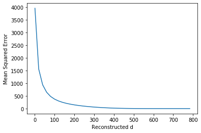
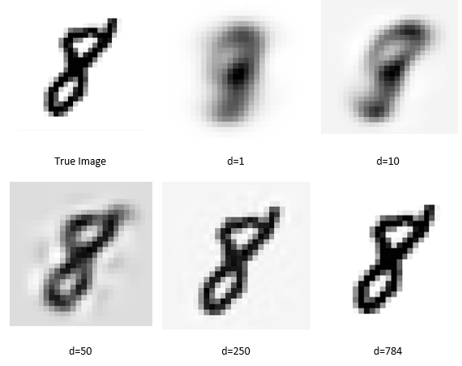
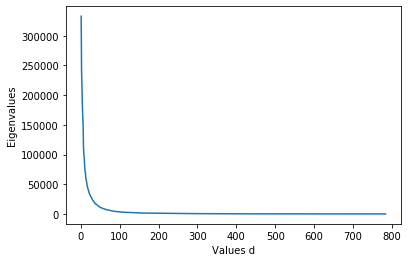

# PCA_image
This program uses PCA image compression of the MNIST dataset which contains a set of images containing the digits 0 to 9. Each image in the data set is a 28x28 image.
The program has the following functions:
1) Programs PCA that takes the image data X(DxN) and returns Y(dxN) where N is the number of
samples, D is the number of input features, and d is the number of features selected by
the PCA algorithm. 
2) Propose a suitable d using proportion of variance (POV) =95%
3) Program PCA reconstruction that takes 𝑌𝑃𝐶𝐴(dxN) and returns 𝑋̂ (DxN) (i.e., a
reconstructed image). For different values of d= {1, 20, 40, 60, 80, …, 760, 784}
reconstruct all samples and calculate the average mean square error (MSE). 
4) Reconstruct a sample from the class of number ‘8’ and show it as a ‘png’ image for d=
{1, 10, 50, 250, 784}.  
5) For the values of d= {1, 2, 3, 4, …, 784} plot eigenvalues (y-axis) versus d (x-axis).  

The suitable d proposed to achieve a proportion of variance POV = 95% is 154 resulting in a POV of 95.02%.  
The average mean square error (MSE) values for the reconstructed image for the specified d values.  
  
The error in the image reduces dramatically as the initial number of d is increased from 0 to 100 where the error reaches a steady state at around 3000. The initial improvement in error has diminishing returns after approximately 200 where the error does not decrease much further.  
The class number ‘8’ was reconstructed from the sample and displayed for a variety of d values.  
  
The eigenvalues as a function of d are shown.  
  
Most of the information about the image is within the first 50 d values. After around 200 d the eigenvalues do not contribute a lot to the overall clarity of the image which was demonstrated in part b where in order to capture 95% of the proportion of variance only 154 d was required. 
